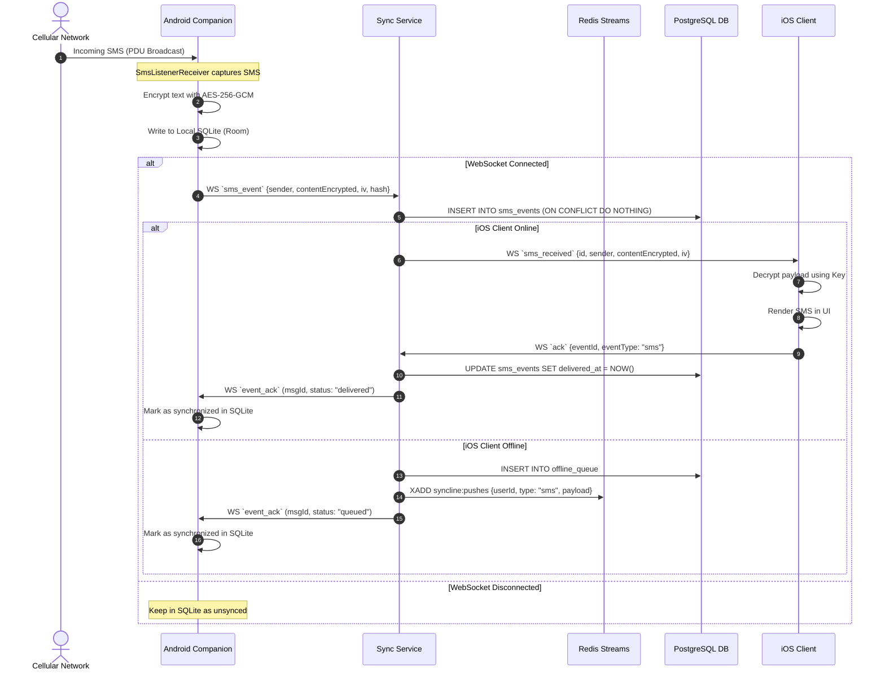
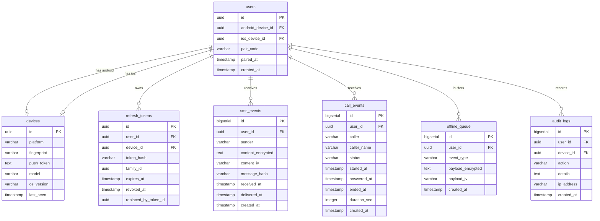

# SyncLine System Architecture

SyncLine is a real-time, cross-platform bridging system designed to synchronize telephony events (SMS, phone calls, and push notifications) from a SIM-enabled Android companion device to a SIM-less iOS device. It utilizes a secure, low-latency microservices architecture, implementing real-time WebSockets, Redis Streams, and direct end-to-end encrypted WebRTC audio streams.

---

## 1. System Overview

The system consists of three primary components:
1. **Android Companion App (SIM-enabled):** Runs continuously as a foreground service to capture incoming SMS, calls, and notifications, encrypting the payload before relaying it.
2. **Backend Microservices (Node.js / TypeScript / Fastify):** Relays data, handles authentication, facilitates pairing, manages offline message queues, and runs the WebRTC signaling gateway.
3. **iOS Client (SIM-less):** Receives and decrypts events, presenting them via standard SwiftUI views. It integrates with iOS CallKit and PushKit to simulate native incoming call UI and receives WebRTC audio streams directly from the Android device.

```mermaid
graph TD
    subgraph Android Device [Android Companion (SIM)]
        A_Service[Foreground Service] --> A_Capture[SMS/Call Monitor]
        A_Service --> A_WebRTC[WebRTC Bridge]
        A_Service --> A_WS[WebSocket Client]
        A_DB[(Room Database)] <--> A_Service
    end

    subgraph Backend Services [SyncLine Backend Cloud]
        B_Nginx[NGINX Reverse Proxy]
        B_Auth[Auth Service:3001]
        B_Sync[Sync Service:3000]
        B_Relay[Relay Service:3002]
        B_Push[Push Service]
        
        B_Nginx --> B_Auth
        B_Nginx --> B_Sync
        B_Nginx --> B_Relay
        
        B_Redis[(Redis Streams & PubSub)] <--> B_Sync
        B_Redis <--> B_Relay
        B_Redis --> B_Push
        
        B_Postgres[(PostgreSQL Database)] <--> B_Auth
        B_Postgres <--> B_Sync
        B_Postgres <--> B_Push
        
        B_Coturn[CoTURN STUN/TURN]
    end

    subgraph iOS Device [iOS Client (No SIM)]
        I_App[SwiftUI Application] --> I_WS[WebSocket Client]
        I_App --> I_WebRTC[WebRTC Client]
        I_App --> I_CallKit[CallKit / PushKit]
        I_KC[(iOS Keychain)] <--> I_App
    end

    %% Network Connections
    A_WS <==>|WebSocket WSS| B_Sync
    I_WS <==>|WebSocket WSS| B_Sync
    A_WebRTC <==>|WebRTC Signaling WSS| B_Relay
    I_WebRTC <==>|WebRTC Signaling WSS| B_Relay
    
    A_WebRTC <==>|Direct WebRTC Audio Stream| I_WebRTC
    A_WebRTC -.->|ICE / TURN Relay| B_Coturn
    I_WebRTC -.->|ICE / TURN Relay| B_Coturn
    
    B_Push -->|APNs / FCM| I_CallKit
```

---

## 2. Component Architecture

### 2.1. Android Companion (Source)
The companion app is designed for high reliability and low battery consumption while maintaining a continuous connection to the backend.

*   **CompanionForegroundService:** The primary service that coordinates lifecycle events, handles websocket states, and holds continuous CPU wake locks (`PARTIAL_WAKE_LOCK`) and Wi-Fi locks (`WIFI_MODE_FULL_HIGH_PERF`).
*   **SmsListenerReceiver:** A broadcast receiver listening for `android.provider.Telephony.SMS_RECEIVED`. It intercepts incoming SMS details, generates cryptographic metadata, and pushes the event to the queue.
*   **CallEventMonitor & PhoneStateListener:** Monitors cellular call transitions (`RINGING`, `OFFHOOK`, `IDLE`). Wakes up the WebRTC bridge on incoming ringing states.
*   **NotificationMirrorService:** Subscribes to device notifications using Android's `NotificationListenerService`. Intercepts incoming messages from whitelisted applications (e.g., WhatsApp, Telegram).
*   **WebRtcBridge:** Manages native Google WebRTC wrapper connections, captures microphone input, configures hardware echo cancellation, and relays ice candidates/SDP to the signaling server.
*   **Room SQLite Database:** Provides persistent local storage for events when the network is unavailable.

### 2.2. Backend Services
The backend is structured as Node.js microservices written in TypeScript, using Fastify for high-performance HTTP routing and WebSocket handling.

#### 2.2.1. Auth Service (Port 3001)
*   Handles device registration, issuing cryptographically secure IDs, and validating client fingerprints.
*   Coordinates the **6-digit dynamic pairing code** system used to bind iOS devices to Android accounts.
*   Implements **Refresh Token Rotation (RTR)** to prevent token replay attacks. If reuse is detected, all tokens in the family are immediately invalidated.

#### 2.2.2. Sync Service (Port 3000)
*   Maintains the primary persistent WebSocket (`/ws`) connection for both Android and iOS devices.
*   Decouples message relaying by publishing events to Redis Pub/Sub for cross-node routing.
*   Manages the **Offline Queue** inside PostgreSQL. If an iOS client is disconnected, it queues SMS/call metadata and flags a push request.

#### 2.2.3. Relay Service (Port 3002)
*   Exposes a dedicated WebSocket endpoint (`/signaling`) for WebRTC session orchestration.
*   Authenticates signaling connections with JWT and generates dynamic, time-limited TURN/STUN credentials using `TURN_SECRET`.
*   Acts as a low-latency routing path for SDP offers, SDP answers, and ICE candidate details.

#### 2.2.4. Push Service (Background Consumer)
*   Consumes message events from the `syncline:pushes` Redis Stream.
*   Routes FCM notifications for Android wake-ups (if needed) and **APNs / VoIP PushKit notifications** for iOS. Wakes up the iOS client in the background on incoming calls.

---

## 3. Core Data Flow & Real-Time Sync

### 3.1. SMS Capture and Sync Flow
This diagram details how an incoming SMS event is received by the Android companion, stored, routed, and finally acknowledged by the iOS client.



---

## 4. WebRTC Audio Streaming Architecture

To enable the iOS client to listen to and interact with real-time phone calls occurring on the Android companion, a direct WebRTC audio connection is established.

### Call Connection Establishment
1.  **Call Trigger:** Android detects `PhoneStateListener.LISTEN_CALL_STATE` transitioning to `RINGING`.
2.  **Signaling Wakeup:** Android initiates a signaling socket connection. The iOS client is woken up via APNs VoIP Push (`PushKit`).
3.  **SDP Exchange:**
    *   Android generates a WebRTC SDP **Offer** and sends it via the Relay Service.
    *   iOS receives the Offer, triggers `CallKit` UI, generates an SDP **Answer**, and replies.
4.  **ICE Negotiation:** Both clients communicate with the STUN/TURN (CoTURN) servers to gather candidate IPs (host, server reflexive, or relay).
5.  **Media Stream:** Once a direct or relayed route is established, an encrypted SRTP (Secure Real-time Transport Protocol) audio channel is bound. Android routes cellular in-call audio (via phone microphone/audio capture loop) into the WebRTC stream, while iOS plays it.

---

## 5. Database Schema Design

PostgreSQL acts as the persistent system-of-record. Below is the relational database layout optimized for fast querying and offline synchronization.



### Table Dictionary Summary

1.  **devices:** Keeps tracks of client devices, platforms, target Push tokens (FCM/APNs), and device details.
2.  **users:** Represents a paired pair of Android and iOS devices. Stores the pairing code and pairing timestamps.
3.  **refresh_tokens:** Implements secure JWT token refresh rotation. Stores SHA-256 hashes of refresh tokens, rotation family identifiers, and revocation states.
4.  **sms_events:** Stores E2E encrypted SMS logs. Contains sender metadata and unique message hashes to avoid duplicate inserts.
5.  **call_events:** Logs calls, durations, states, and participant info.
6.  **offline_queue:** Stores serialized JSON representations of events that are currently waiting to be delivered to an offline iOS client.

---

## 6. Infrastructure & Scalability

### 6.1. Load Balancing (Nginx Config)
Nginx acts as the entry point and terminates SSL connections.
*   **HTTP Routing:** Splits traffic based on path prefixes (`/api/auth` -> Auth Service, `/ws` -> Sync Service, `/signaling` -> Relay Service).
*   **WebSocket Upgrade:** Configures `Upgrade` and `Connection` headers to maintain long-lived stateful sockets.

### 6.2. Redis Layer
*   **Pub/Sub:** Handles cross-instance routing. If Device A is connected to Node 1, and Device B is connected to Node 2, Redis bridges the message delivery.
*   **Streams (`syncline:pushes`):** Uses consumer groups inside Redis to ensure high-performance, persistent streaming of notification requests, guaranteeing that notifications are never lost during service failovers.

### 6.3. Docker & Kubernetes Layout
The systems are packaged in lightweight Alpine-based Docker containers.
*   Deployments use a Kubernetes architecture with Horizontal Pod Autoscalers (HPA) targeting CPU utilization.
*   Sticky sessions are not required because cross-node routing is managed seamlessly by Redis.
